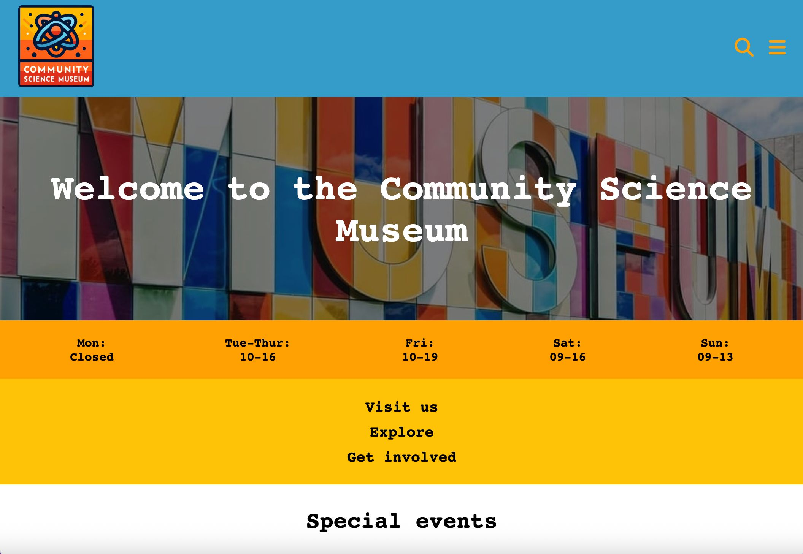

# 🧪 Semester Project 1 – Community Science Museum

A responsive, accessible website for a fictional science museum aimed at children aged 7–15 and their families. The site was designed and built using only HTML and CSS, based on a professional-style brief and includes several pages with educational and interactive content.

---

## 📌 Purpose

This project simulates working with a real-world client brief, focusing on building a modern, engaging, and accessible website for a new science museum near the user’s location.

---

## 🧰 Built With

- **HTML5** - Semantic and accessible structure
- **CSS3** – Responsive layout using Flexbox and Grid

---

## 📄 Pages Included

- **Home Page** – Introduction, featured exhibitions, and key highlights
- **Exhibitions Page** – List of current and upcoming exhibitions
- **Contribution Page** – Ways to support or volunteer at the museum
- **Contact Page** – Address, opening hours, contact form (non-functional)
- **Terms & Privacy** – Legal information about site usage

---

## 🚀 Getting Started

To view the project locally:

1. Clone the repository:

git clone https://github.com/hallsi90/Semester-Project-1.git

2. Open index.html in your browser.

This is a static site – no installation is required.

---

## 🎯 Project Goals

- Design a full website based on a client-style brief
- Build pages using semantic HTML and DRY CSS principles
- Ensure full accessibility and responsiveness across devices
- Optimize layout and assets for performance and user experience

---

## ✅ Status

- 🎓 Completed as part of Semester Project 1 at Noroff
- ✅ HTML and CSS validated using W3C tools
- ✅ Fully responsive across mobile, tablet, and desktop
- ✅ Submitted with Figma wireframes and written report

---

## 🙏 Acknowledgments

- Noroff Frontend Development Program
- Teacher feedback and guidance
- Content resources provided in the course brief
- W3C Validator and WAVE Accessibility Tools

---

## 🔗 Useful Links

- [GitHub Repository – Semester Project 1](https://github.com/hallsi90/Semester-Project-1)
- [GitHub Kanban Board](https://github.com/users/hallsi90/projects/1/views/1)
- [Live Website](https://hallsi90.github.io/Semester-Project-1/)
- [Figma File – Design & Wireframes](https://www.figma.com/design/Biet1O83FrsdinZYjlH72V/Semester-Project-1?node-id=0-1&t=7Sgpw7g7lNZDGABj-0)
